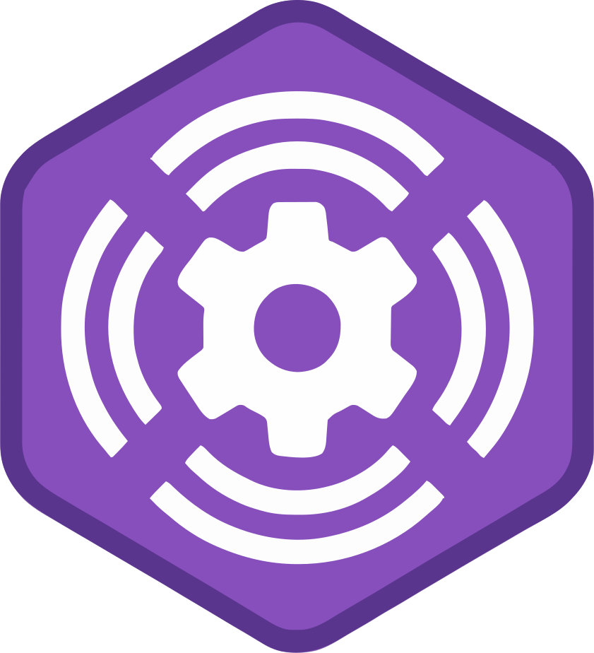

# Configarr

  

Configarr is an open-source tool designed to simplify configuration and synchronization for Sonarr and Radarr (and other experimental).
It integrates with TRaSH Guides to automate updates of custom formats, quality profiles, and other settings, while also supporting user-defined configurations.
Configarr offers flexibility with deployment options like Docker and Kubernetes, ensuring compatibility with the latest versions of Sonarr and Radarr.
By streamlining media server management, it saves time, enhances consistency, and reduces manual intervention.

Official support only for Sonarr v4 and radarr v5.

This will be a project similar to [Recyclarr](https://github.com/recyclarr/recyclarr) or [Notifiarr](https://notifiarr.wiki/) but support for additional specification and not only what [TRaSH-Guides](https://trash-guides.info/) offer.

## Container Images

Images are available via Github Container Registry (ghcr) and dockerhub with tags and latest (check the repos for all available tags):

- [GHCR:](https://github.com/raydak-labs/configarr/pkgs/container/configarr)
  - `ghcr.io/raydak-labs/configarr:latest`
- [DockerHub:](https://hub.docker.com/repository/docker/configarr/configarr/general)
  - `docker.io/configarr/configarr:latest` or simply `configarr/configarr:latest`

## Features

- Use TRaSH-Guides defined custom formats
- Compatible with recyclarr templates
- Include own defined custom formats
- Custom defined formats for different languages/countries like Germany
- Support all CustomFormat specifications
- Provide CFs in different ways
  - Sync from TRaSH-Guides
  - Sync with local file CFs
  - Provide CFs directly in config (Convert JSON with https://www.bairesdev.com/tools/json2yaml/)
  - Merge order is `TRaSH-Guides -> LocalFiles -> CFs in Config`

### Supported \*arr Applications

- Radarr v5
- Sonarr v4
- Whisparr (experimental)
- Readarr (experimental)
- Lidarr (experimental)

## Configuration

Full documentation can be found here: [Documentation](https://configarr.raydak.de)

- `config.yml`
  - Check the template file [template](./config.yml.template) or check the examples.
  - You can provide values with the custom tags:
    - `value: !secret secretKey`: Loads the value from the secrets file with the key `secretKey`
    - `value: !env ENV_NAME`: Loads the value from the environment variable `ENV_NAME`

## Custom formats

This repository also provide additional custom formats what TRaSH-Guides does not offer.

See [here](./custom/cfs/)

- Most CustomFormats used from @PCJones
  - See here: https://github.com/PCJones/radarr-sonarr-german-dual-language
  - Or good german guide: https://github.com/PCJones/usenet-guide

## Development

1. Optionally setup the local sonarr instance
   1. Run `docker compose up -d` to run the container
   2. Open sonarr in your browser at http://localhost:8989 / radarr @ http://localhost:7878
   3. Configure basic authentication, disable local authentication and create an initial user by specifying the e-mail and password
2. Open the sonarr [Settings > General](http://localhost:8989/settings/general) page and copy the API key
3. Create a `secrets.yml` from the template
   1. `cp secrets.yml.template secrets.yml`
   2. Replace the placeholder with your sonarr API key
4. Create a `config.yml` from the template
   1. `cp config.yml.template config.yml`
   2. Overwrite the hosts in case you are not using the local setup with docker compose
5. Run the app with `pnpm start` or with the vscode task

Tip: Beside from those steps you can also always test and work with the `full example` and utilizing the docker container with mounted `src` directory.

## Examples

Some examples for configuration are provided [Examples](./examples/)

## Related projects

You can compare features here: [Feature Comparison](https://configarr.raydak.de/docs/comparison)

- https://github.com/recyclarr/recyclarr
- https://notifiarr.wiki/
- https://github.com/Dictionarry-Hub/profilarr
