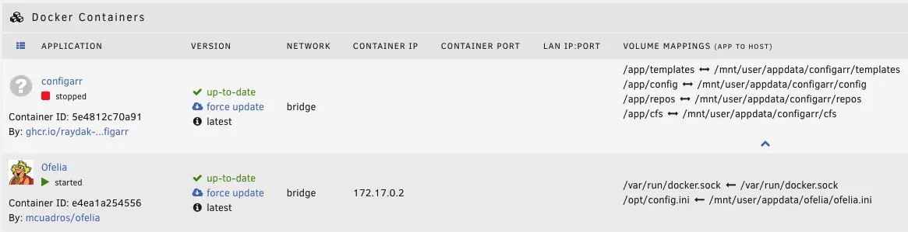

# Third partys

This guide will walk you through setting up Configarr in 3rd party services.

:::tip
As this is new and you are missing some services feel free to create a PR!

Contributions welcome!
:::

## Unraid {#unraid}

:::tip
Existing apps in Unraid CA are not maintained by us!
If donating it is not directed to us! Please check configarr Github pages if you want to donate.
Contributions welcome!
:::

Setting up in Unraid with docker is straigth forward and combined with `ofelia` we can schedule the containers easily.

_HINT_: The provided Apps in Unraid are not maintained by us!

Make sure to enable Advanced/extended view in Unraid (top right).

- Configarr:

  ```
  Name: configarr (we need this later on)
  Repository: configarr/configarr:latest # Recommendation: use tags like 1.9.0

  (add volume mappings like your setups requires it. Example with <name> - <host/unraid path>:<container path>)
  Config volume - /mnt/user/appdata/configarr/config:/app/config
  Repo cache - /mnt/user/appdata/configarr/repos:/app/repos
  Custom formats - /mnt/user/appdata/configarr/cfs:/app/cfs
  Templates - /mnt/user/appdata/configarr/templates:/app/templates
  ```

  - Add other variables or mapping as your setup requires it
  - Afterwards create the required files in the config volume `config.yml` and `secrets.yml` (check examples or this guide)

- Ofelia (scheduler):

  ```
  Name: ofelia
  Repository: mcuadros/ofelia:latest # Recommendation: use specific tags not latest
  Post Arguments: daemon --config=/opt/config.ini

  (add volume mappings like your setups requires it. Example with <name> - <host/unraid path>:<container path>)
  Docker socket - /var/run/docker.sock:/var/run/docker.sock (Read Only)
  Ofelia config file - /mnt/user/appdata/ofelia/ofelia.ini:/opt/config.ini (Read only)
  ```

  - Make sure to create the `ofelia.ini` file best before starting the container

  ```ini
  [job-run "run-configarr-existing-container"]
  schedule = @every 10s # adjust as required. Recommendation every 3h or so
  container = configarr # this is the name of container we gave
  ```

  - you can also activate `autostart` for ofelia



Now start both containers.
Check the logs if configarr works as expected (exit code should be 0).
Ofelia should keep running and restarting the configarr in your defined interval.

**Enjoy!**

## Synology NAS {#synology}

For scheduled runs on Synology you can use the [Task Scheduler](https://kb.synology.com/en-au/DSM/help/DSM/AdminCenter/system_taskscheduler?version=7) in order to run configarr in a cron way.
To configure a scheduled task in DSM 7.2 you go to Control Panel - Services - Task Scheduler. From there you can create a new Scheduled Task (User-defined script).
As Synology requires root permission to run docker containers, "root" should be chosen as the user. Then within the Schedule tab you can choose your preferred frequency to run configarr.
For the actual user-defined script you just input the docker run command you also use in an interactive terminal, but be sure to NOT include `sudo` in your command (as your already run the command with root permissions). Like so:
```
docker run -d --rm --name=configarr -e TZ=[YOUR-TIMEZONE] -v /[SYNOLOGY-VOLUME]/[SYNOLOGY-SHARED-FOLDER-OF-YOUR-DOCKER-CONTAINERS]/[CONFIGARR-SUBFOLDER]:/app/config ghcr.io/raydak-labs/configarr:[REQUIRED-VERSION]
```

For example:
```
docker run -d --rm --name=configarr -e TZ=Europe/Amsterdam -v /volume1/docker/configarr:/app/config ghcr.io/raydak-labs/configarr:1.12.0
```

Alternatively if you want to be able to view the logs within Synology's Container Manager after configarr has finished running, then you could remove the `--rm` flag and start the user-defined script with `docker rm configarr` so that the container is not immediately removed after it has finished running. For example:
```
docker rm configarr
docker run -d --name=configarr -e TZ=Europe/Amsterdam -v /volume1/docker/configarr:/app/config ghcr.io/raydak-labs/configarr:1.12.0
```

After clicking "OK" it will ask for your password, given that you created a scheduled script with root permissions. After you're done you can perform a run manually to check if everything works by selecting the task and press "Run".
