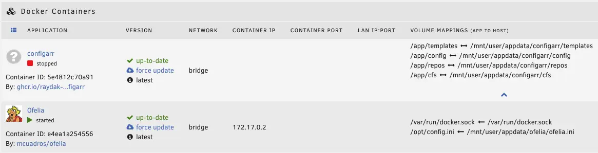

# Third partys

This guide will walk you through setting up Configarr in 3rd party services.

:::tip
As this is new and you are missing some services feel free to create a PR!

Contributions welcome!
:::

## Proxmox VE Helper-Scripts

<div style={{ textAlign: "center" }}>
  
</div>

Thanks to Community User @finkerle we have now an installation script for Proxmox users!
With the script you can install & update the configarr version in your proxmox instance automatically.
The instance will be deployed as an LXC Container.

Check it out here [Configarr Proxmox Helper](https://community-scripts.github.io/ProxmoxVE/scripts?id=configarr).

## Unraid {#unraid}

:::tip
Existing apps in Unraid CA are not maintained by us!
If donating it is not directed to us! Please check configarr Github pages if you want to donate.
Contributions welcome!
:::

Setting up in Unraid with docker is straigth forward and combined with `ofelia` we can schedule the containers easily.

_HINT_: The provided Apps in Unraid are not maintained by us!

Make sure to enable Advanced/extended view in Unraid (top right).

- Configarr:

  ```
  Name: configarr (we need this later on)
  Repository: configarr/configarr:latest # Recommendation: use tags like 1.9.0

  (add volume mappings like your setups requires it. Example with <name> - <host/unraid path>:<container path>)
  Config volume - /mnt/user/appdata/configarr/config:/app/config
  Repo cache - /mnt/user/appdata/configarr/repos:/app/repos
  Custom formats - /mnt/user/appdata/configarr/cfs:/app/cfs
  Templates - /mnt/user/appdata/configarr/templates:/app/templates
  ```

  - Add other variables or mapping as your setup requires it
  - Afterwards create the required files in the config volume `config.yml` and `secrets.yml` (check examples or this guide)

- Ofelia (scheduler):

  ```
  Name: ofelia
  Repository: mcuadros/ofelia:latest # Recommendation: use specific tags not latest
  Post Arguments: daemon --config=/opt/config.ini

  (add volume mappings like your setups requires it. Example with <name> - <host/unraid path>:<container path>)
  Docker socket - /var/run/docker.sock:/var/run/docker.sock (Read Only)
  Ofelia config file - /mnt/user/appdata/ofelia/ofelia.ini:/opt/config.ini (Read only)
  ```

  - Make sure to create the `ofelia.ini` file best before starting the container

  ```ini
  [job-run "run-configarr-existing-container"]
  schedule = @every 10s # adjust as required. Recommendation every 3h or so
  container = configarr # this is the name of container we gave
  ```

  - you can also activate `autostart` for ofelia



Now start both containers.
Check the logs if configarr works as expected (exit code should be 0).
Ofelia should keep running and restarting the configarr in your defined interval.

**Enjoy!**

## Synology NAS {#synology}

For scheduled runs on Synology you can use the [Task Scheduler](https://kb.synology.com/en-au/DSM/help/DSM/AdminCenter/system_taskscheduler?version=7) in order to run configarr in a cron way.
First make sure to have run the configarr container successfully at least once, either via cli or via the Synology Container Manager. The container should then have exited and will be sitting in a "stopped" state. For this to work, make sure to not use auto-restart (`restart: no`). Via cli this would be something like this:

```
sudo docker run -d --name=configarr -e TZ=[YOUR-TIMEZONE] -v /[SYNOLOGY-VOLUME]/[SYNOLOGY-SHARED-FOLDER-OF-YOUR-DOCKER-CONTAINERS]/[CONFIGARR-SUBFOLDER]:/app/config ghcr.io/raydak-labs/configarr:[REQUIRED-VERSION]
```

For example:

```
sudo docker run -d --name=configarr -e TZ=Europe/Amsterdam -v /volume1/docker/configarr:/app/config ghcr.io/raydak-labs/configarr:1.30.2
```

To then configure a scheduled task in DSM 7 you go to Control Panel - Services - Task Scheduler. From there you can create a new Scheduled Task (User-defined script).
As Synology requires root permission to start docker containers, "root" should be chosen as the user. Then within the Schedule tab you can choose your preferred frequency to run configarr.
For the actual user-defined script you indicate to start the configarr container that is in a stopped state. This is done by container name (`configarr` in this example), so make sure to use the same name as you used for the stopped container. Moreover, be sure to NOT include `sudo` in your command (as you are already running the command with root permissions). Like so:

```
docker container start configarr
```

After clicking "OK" it will ask for your password, given that you created a scheduled script with root permissions. When you're done you can perform a run manually to check if everything works by selecting the task and press "Run".
Afterwards you can view the logs of all runs in Synology Container Manager.
Note that the `start` command will not pull a new image. For a version bump, the container will have to be recreated.

## NixOS Module <span className="theme-doc-version-badge badge badge--secondary configarr-badge">1.18.0</span> {#nixos}

:::warning Experimental Feature
NixOS module support is experimental and available from version 1.18.0 onwards.
:::

Configarr can be run as a systemd service on NixOS using the included NixOS module.

### Setup

Include the configarr input in your flake:

```nix
inputs.configarr.url = "github:raydak-labs/configarr";
```

Then import the module and configure the service:

```nix
{
  config,
  inputs,
  ...
}: {
  imports = [
    inputs.configarr.nixosModules.default
  ];

  services.configarr = {
    config =
      # yaml
      ''
        radarr:
          radarr_instance:
            api_key: !env RADARR_API_KEY
            base_url: http://localhost:${toString config.services.radarr.settings.server.port}
            media_naming:
              folder: default
            root_folders:
              - /mnt/movies/English
      '';
    enable = true;
    environmentFile = "${config.sops.templates.configarr-ev.path}";
  };

  sops = {
    secrets = {
      radarr-api-key.sopsFile = ./secrets/radarr-api-key;
    };
    templates.configarr-ev = {
      content = ''
        LOG_LEVEL=debug
        LOG_STACKTRACE=true
        RADARR_API_KEY=${config.sops.placeholder.radarr-api-key}
      '';
      inherit (config.services.configarr) group;
      owner = config.services.configarr.user;
    };
  };
}
```

This configuration sets up configarr as a systemd service with proper secret management using sops-nix.

### Updating to a New Version

The package builds the revision you pin. To stay on a release, pin its tag:

```nix
inputs.configarr.url = "github:raydak-labs/configarr/v1.35.0";
```

Then update the lock:

```bash
nix flake update configarr
```

An input without a ref follows the default branch and builds that branch.

Release tags through v1.34.0 still point `pkgs/nix/package.nix` at the previous version: that metadata was committed after the tag. Pin a later release to build the tagged sources.
